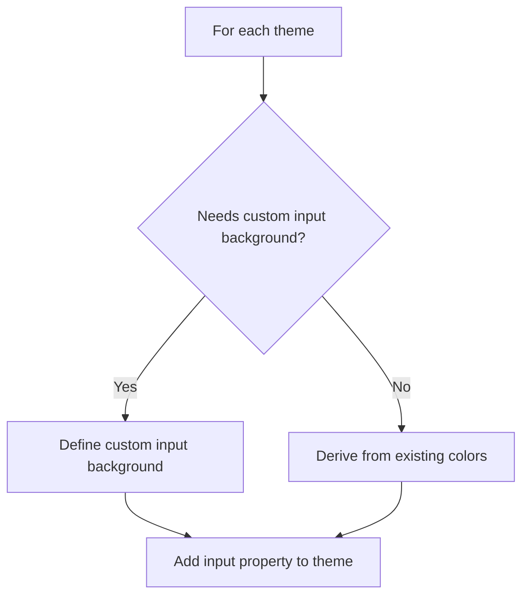
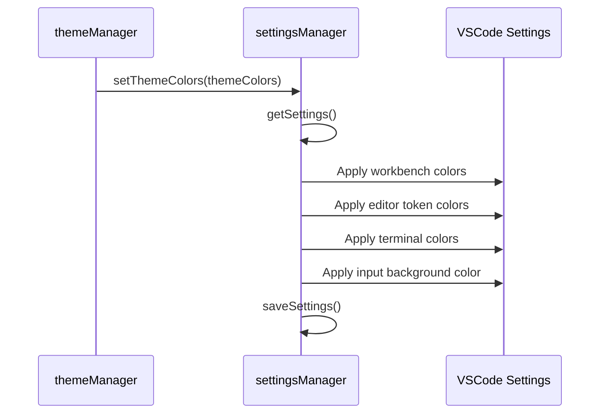

# Plan for Adding Input Text Background to VSW Themes

## Overview

The VSW (VSCode Theme Switcher) project currently allows users to switch between different VSCode themes and apply custom colors for the editor, workbench, and terminal. This plan outlines how we'll extend this functionality to include input text background colors as well, ensuring a consistent theme experience across all parts of the VSCode interface.

## Current Architecture

The project has the following key components:

1. **Theme Definitions**:

   - `ThemeColors` interface in `theme-colors.ts` defines the structure for theme colors
   - Pastel themes defined in `theme-colors.ts`
   - Vivid themes defined in `vivid-themes.ts`
   - Color themes defined in `color-themes.ts`

2. **Theme Management**:

   - `themeManager` in `theme-manager.ts` handles setting themes and theme colors
   - `settingsManager` in `settings.ts` handles reading/writing VSCode settings
   - `configManager` in `utils/config.ts` handles user configuration

3. **CLI Commands**:
   - Commands defined in `cli.ts` for user interaction

## Detailed Implementation Plan

### 1. Update the ThemeColors Interface

First, we need to update the `ThemeColors` interface in `theme-colors.ts` to include input text background colors:

```typescript
export interface ThemeColors {
  workbench: Record<string, string>;
  editor: {
    tokenColors: Array<{
      scope: string[] | string;
      settings: {
        foreground?: string;
        fontStyle?: string;
      };
    }>;
  };
  terminal?: {
    background?: string;
    foreground?: string;
  };
  input?: {
    background?: string;
  };
}
```

The `input` property is optional to maintain backward compatibility with existing code.

### 2. Add Input Background Colors to Existing Themes

For each theme in the codebase, we'll add input background colors using a mix of:

- Deriving from existing colors (e.g., using editor or workbench background with slight adjustments)
- Custom colors where needed for better contrast or readability

#### Example for Pastel Light Theme:

```typescript
export const pastelLightColors: ThemeColors = {
  workbench: {
    // existing workbench colors
  },
  editor: {
    // existing editor colors
  },
  terminal: {
    // existing terminal colors
  },
  input: {
    background: "#f1f2f4", // Same as sideBar.background for consistency
  },
};
```

#### Example for Pastel Dark Theme:

```typescript
export const pastelDarkColors: ThemeColors = {
  workbench: {
    // existing workbench colors
  },
  editor: {
    // existing editor colors
  },
  terminal: {
    // existing terminal colors
  },
  input: {
    background: "#21252b", // Same as sideBar.background for consistency
  },
};
```

### 3. Update Settings Manager

We'll update the `settingsManager.setThemeColors` method in `src/settings.ts` to apply input background colors:

```typescript
setThemeColors: async (themeColors: ThemeColors): Promise<void> => {
  try {
    const settings = await settingsManager.getSettings();

    // Set workbench color customizations
    const colorCustomizations = { ...themeColors.workbench };

    // Add terminal colors if provided
    if (themeColors.terminal) {
      if (themeColors.terminal.background) {
        colorCustomizations["terminal.background"] =
          themeColors.terminal.background;
      }
      if (themeColors.terminal.foreground) {
        colorCustomizations["terminal.foreground"] =
          themeColors.terminal.foreground;
      }
    }

    // Add input background color if provided
    if (themeColors.input?.background) {
      colorCustomizations["input.background"] = themeColors.input.background;
      // Add specific selectors for Copilot chat input
      colorCustomizations["chat.editor.background"] = themeColors.input.background;
      colorCustomizations["editorWidget.background"] = themeColors.input.background;
    }

    settings["workbench.colorCustomizations"] = colorCustomizations;

    // Set editor token color customizations
    settings["editor.tokenColorCustomizations"] = {
      textMateRules: themeColors.editor.tokenColors,
    };

    await settingsManager.saveSettings(settings);
    logger.success("Theme colors applied");
  } catch (error) {
    logger.error(`Failed to set theme colors: ${error}`);
    throw error;
  }
},
```

### 4. Update Documentation

We'll update the README.md to include information about input background color customization:

```markdown
### Input Background Colors

All themes now include input background color customizations that match or complement the theme's color scheme. When you set a theme, the input background color will automatically be updated to provide a consistent experience across your entire VSCode environment. This includes the Copilot chat input background, providing a cohesive look throughout your coding environment.
```

## File Changes Summary

1. `src/theme-colors.ts`:

   - Update `ThemeColors` interface
   - Add input background colors to all pastel themes

2. `src/vivid-themes.ts`:

   - Add input background colors to all vivid themes

3. `src/color-themes.ts`:

   - Add input background colors to all color themes

4. `src/settings.ts`:

   - Update `setThemeColors` method to apply input background colors

5. `README.md`:
   - Add documentation about input background color customization

## Implementation Steps

1. Update the `ThemeColors` interface
2. Add input background colors to pastel themes
3. Add input background colors to vivid themes
4. Add input background colors to color themes
5. Update the settings manager
6. Update documentation
7. Test all themes

## Testing Plan

1. Test setting each type of theme (pastel, vivid, color) and verify that input background colors are applied correctly
2. Test with both dark and light themes to ensure proper contrast in input fields
3. Test clearing theme colors to ensure input background colors are also cleared

## Visual Representation

```mermaid
classDiagram
    class ThemeColors {
        +workbench: Record<string, string>
        +editor: {tokenColors: Array}
        +terminal: {background: string, foreground: string}
        +input: {background: string}
    }
```




