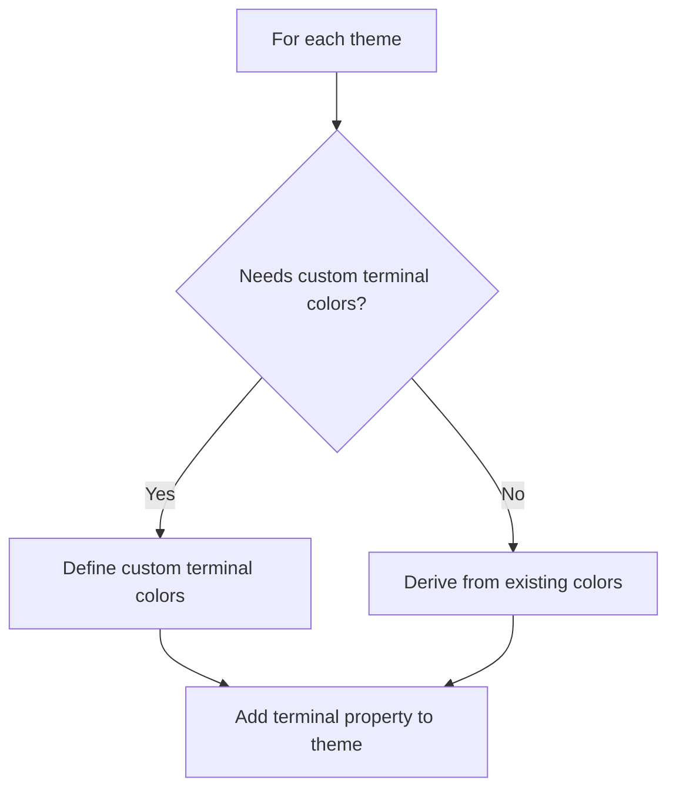
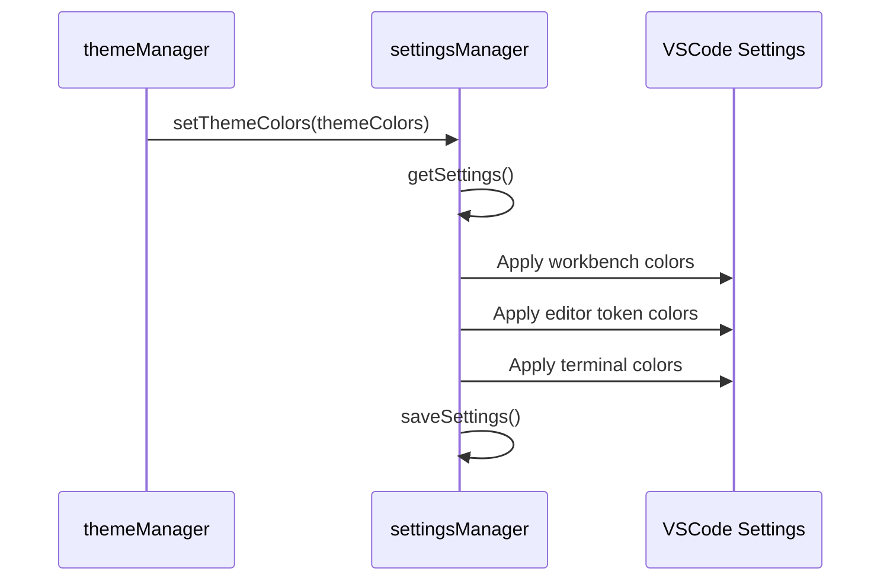

# Plan for Adding Terminal Colors to VSW Themes

## Overview

The VSW (VSCode Theme Switcher) project currently allows users to switch between different VSCode themes and apply custom colors for the editor and workbench. This plan outlines how we'll extend this functionality to include terminal colors as well, specifically the terminal background and text colors.

## Current Architecture

The project has the following key components:

1. **Theme Definitions**:

   - `ThemeColors` interface in `theme-colors.ts` defines the structure for theme colors
   - Pastel themes defined in `theme-colors.ts`
   - Vivid themes defined in `vivid-themes.ts`
   - Color themes defined in `color-themes.ts`

2. **Theme Management**:

   - `themeManager` in `theme-manager.ts` handles setting themes and theme colors
   - `settingsManager` in `settings.ts` handles reading/writing VSCode settings
   - `configManager` in `utils/config.ts` handles user configuration

3. **CLI Commands**:
   - Commands defined in `cli.ts` for user interaction

## Detailed Implementation Plan

### 1. Update the ThemeColors Interface

First, we need to update the `ThemeColors` interface in `theme-colors.ts` to include terminal colors:

```typescript
export interface ThemeColors {
  workbench: Record<string, string>;
  editor: {
    tokenColors: Array<{
      scope: string[] | string;
      settings: {
        foreground?: string;
        fontStyle?: string;
      };
    }>;
  };
  terminal?: {
    background?: string;
    foreground?: string;
  };
}
```

The `terminal` property is optional to maintain backward compatibility with existing code.

### 2. Add Terminal Colors to Existing Themes

For each theme in the codebase, we'll add terminal colors using a mix of:

- Deriving from existing colors (e.g., using editor background/foreground)
- Custom colors where needed for better contrast or readability

#### Example for Pastel Light Theme:

```typescript
export const pastelLightColors: ThemeColors = {
  workbench: {
    // existing workbench colors
  },
  editor: {
    // existing editor colors
  },
  terminal: {
    background: "#f8f9fa", // derived from editor background
    foreground: "#545c6b", // derived from editor foreground
  },
};
```

#### Example for Synthwave Theme (with custom colors):

```typescript
export const synthwaveColors: ThemeColors = {
  workbench: {
    // existing workbench colors
  },
  editor: {
    // existing editor colors
  },
  terminal: {
    background: "#1e1727", // custom color for better terminal readability
    foreground: "#f0f0ff", // custom color for better terminal readability
  },
};
```

### 3. Update Settings Manager

We'll update the `settingsManager.setThemeColors` method in `src/settings.ts` to apply terminal colors:

```typescript
setThemeColors: async (themeColors: ThemeColors): Promise<void> => {
  try {
    const settings = await settingsManager.getSettings();

    // Set workbench color customizations
    settings['workbench.colorCustomizations'] = {
      ...themeColors.workbench,
      // Add terminal colors if provided
      ...(themeColors.terminal?.background && {
        'terminal.background': themeColors.terminal.background,
      }),
      ...(themeColors.terminal?.foreground && {
        'terminal.foreground': themeColors.terminal.foreground,
      }),
    };

    // Set editor token color customizations (unchanged)
    settings['editor.tokenColorCustomizations'] = {
      textMateRules: themeColors.editor.tokenColors,
    };

    await settingsManager.saveSettings(settings);
    logger.success('Theme colors applied');
  } catch (error) {
    logger.error(`Failed to set theme colors: ${error}`);
    throw error;
  }
},
```

### 4. Update Documentation

We'll update the README.md to include information about terminal color customization:

```markdown
### Terminal Colors

All themes now include terminal color customizations that match or complement the theme's color scheme. When you set a theme, the terminal background and foreground colors will automatically be updated to provide a consistent experience across your entire VSCode environment.
```

## File Changes Summary

1. `src/theme-colors.ts`:

   - Update `ThemeColors` interface
   - Add terminal colors to all pastel themes

2. `src/vivid-themes.ts`:

   - Add terminal colors to all vivid themes

3. `src/color-themes.ts`:

   - Add terminal colors to all color themes

4. `src/settings.ts`:

   - Update `setThemeColors` method to apply terminal colors

5. `README.md`:
   - Add documentation about terminal color customization

## Implementation Steps

1. Update the `ThemeColors` interface
2. Add terminal colors to pastel themes
3. Add terminal colors to vivid themes
4. Add terminal colors to color themes
5. Update the settings manager
6. Update documentation
7. Test all themes

## Testing Plan

1. Test setting each type of theme (pastel, vivid, color) and verify that terminal colors are applied correctly
2. Test with both dark and light themes to ensure proper contrast in the terminal
3. Test clearing theme colors to ensure terminal colors are also cleared

## Visual Representation

```mermaid
classDiagram
    class ThemeColors {
        +workbench: Record<string, string>
        +editor: {tokenColors: Array}
        +terminal: {background: string, foreground: string}
    }
```




